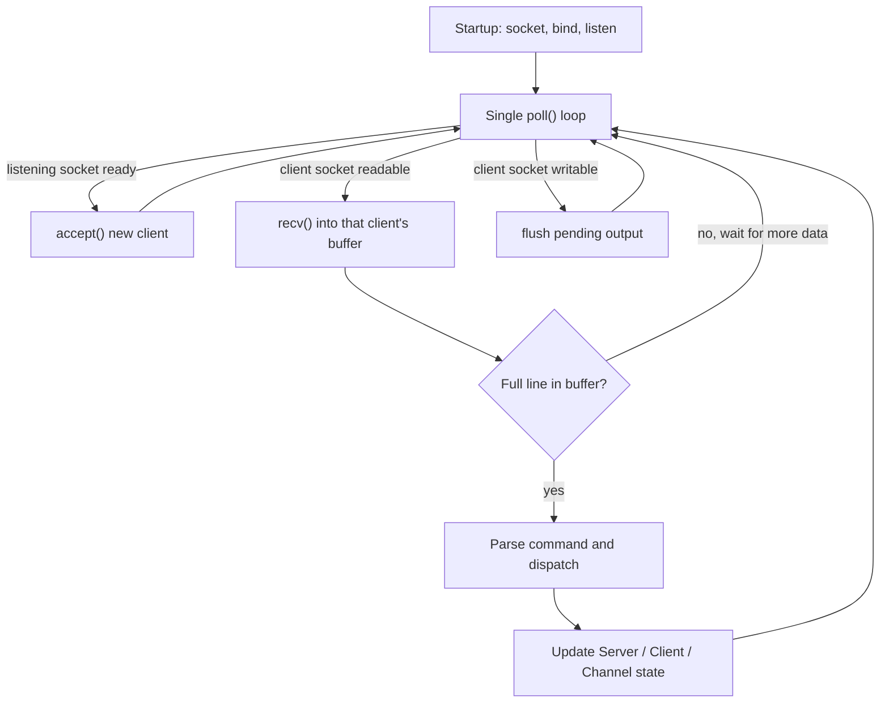

*This project has been created as part of the 42 curriculum by muhaoz, alsagir, htekdemi.*

<div align="center">
# ft_irc

### A from-scratch Internet Relay Chat server, written in C++98


</div>

## Table of Contents
1. [Description](#description)
2. [Features](#features)
3. [Architecture & Technical Choices](#architecture--technical-choices)
4. [Project Structure](#project-structure)
5. [Instructions](#instructions)
6. [Usage Example](#usage-example)
7. [Testing](#testing)
8. [Error Handling & Reliability](#error-handling--reliability)
9. [Compliance Checklist](#compliance-checklist)
10. [Resources](#resources)
11. [Authors](#authors)
12. [License](#license)

## Description
**Internet Relay Chat (IRC)** is one of the oldest real-time, text-based communication protocols on the Internet. It lets people exchange messages publicly in **channels** or privately between two users, with independent servers historically linking together into larger networks.

**ft_irc** is a standalone IRC **server**, written entirely from scratch in **C++98** as part of the 42 School common core curriculum. The goal of the project is to get hands-on experience with low-level network programming — raw TCP sockets, connection multiplexing, and manual protocol parsing — while producing a server that a real, unmodified IRC client can connect to and use normally.

> **Scope.** As required by the subject, this repository contains a **server only**: no IRC client is implemented, and **no server-to-server linking** is implemented. The server is a single, standalone process that speaks enough of the IRC protocol (loosely based on the classic [RFC 1459](#resources) / [RFC 2812](#resources)) to interoperate with off-the-shelf clients for the feature set described below.

At its core, the server:
- accepts and manages an arbitrary number of simultaneous TCP connections;
- **never forks and never blocks** on any I/O operation;
- multiplexes **every** read, write, and accept through a **single** `poll()` (or equivalent) call;
- reconstructs commands that arrive fragmented across multiple reads;
- is designed to **never crash**, regardless of malformed input, abrupt disconnects, or resource pressure.

## Features

### Connection & Authentication
- Listens on a configurable TCP port and accepts multiple concurrent clients over **TCP/IP (IPv4 or IPv6)**.
- Password-protected access via `PASS`, checked against the password supplied on the command line.
- Client registration via `NICK` (nickname, with collision checking) and `USER` (username / real name).
- Keep-alive handling via `PING` / `PONG`.
- Graceful disconnection via `QUIT`, cleanly removing the client from every channel it was in.

### Channels
- Channel creation on the first `JOIN`, and joining of already-existing channels.
- Leaving a channel via `PART`.
- **Broadcasting** — any message sent to a channel with `PRIVMSG` is relayed to every other member of that channel.
- **Private messaging** between two clients via `PRIVMSG <nickname>`.
- A clear distinction between **channel operators** and **regular users**, tracked per channel.

### Channel Operator Commands
| Command | Effect |
|---|---|
| `KICK` | Ejects a client from a channel |
| `INVITE` | Invites a client to a channel (required to join invite-only channels) |
| `TOPIC` | Views or changes the channel topic |
| `MODE` | Changes one or more channel modes (see below) |

### Channel Modes
| Mode | Flag | Effect |
|---|---|---|
| Invite-only | `i` | Only clients who have been `INVITE`d may `JOIN` the channel |
| Topic protection | `t` | Restricts the `TOPIC` command to channel operators |
| Channel key | `k` | Sets or removes a password required to join the channel |
| Operator | `o` | Grants or revokes channel-operator privileges for a client |
| User limit | `l` | Sets or removes the maximum number of clients allowed in the channel |

### Bonus Features
> Per the subject, the bonus part is only graded once the mandatory part is fully working — both features below build directly on top of the mandatory core.

- **IRC bot** — an automated client that connects to the server like any other user, can join channels, and responds to a small set of commands or trigger words. Supported commands are: `!help`, `!ping`, and `!rules`.

## Architecture & Technical Choices
The server follows a classic **single-threaded reactor pattern**: one loop, one `poll()`, no threads, no forked processes.



| Subject requirement | Design decision |
|---|---|
| No forking, no threads | Single process, single-threaded event loop |
| All I/O non-blocking | Every socket is set with `fcntl(fd, F_SETFL, O_NONBLOCK)` right after creation |
| Exactly **one** `poll()` for everything | One `poll()` call per loop iteration watches the listening socket and every connected client for read/write readiness |
| Never branch on `errno` after I/O | Only the return value of `recv`/`send` decides whether a connection is closed; the next attempt is always gated by `poll()` readiness, never by retrying on `EAGAIN` |
| Reassemble fragmented commands | Each client owns a persistent receive buffer; incoming bytes are appended until a full CRLF-terminated line is available, only then is it parsed and removed from the buffer |
| TCP/IP v4 or v6 | Sockets are created through the standard BSD socket API (`socket`, `bind`, `listen`, `accept`, `getaddrinfo`) |
| macOS `write()` quirk | Non-blocking mode is enforced with `fcntl(fd, F_SETFL, O_NONBLOCK)` only — no other flag is used, as required by the subject |

Standard IRC numeric replies (e.g. `001 RPL_WELCOME`, `433 ERR_NICKNAMEINUSE`, `461 ERR_NEEDMOREPARAMS`) are sent back to clients so that real, unmodified IRC clients display meaningful feedback instead of raw errors.

## Project Structure
```
ft_irc/
├── Makefile
├── README.md
├── .gitignore
├── includes/
│   ├── Channel.hpp
│   ├── Client.hpp
│   └── Server.hpp
└── sources/
    ├── main.cpp
    ├── commands/
    │   ├── Authenticate.cpp
    │   ├── Bot.cpp
    │   ├── ChannelOps.cpp
    │   ├── Connection.cpp
    │   └── Messaging.cpp
    ├── core/
    │   ├── Network.cpp
    │   ├── Parser.cpp
    │   └── Server.cpp
    ├── models/
    │   ├── Channel.cpp
    │   └── Client.cpp
    └── utils/
        └── Utils.cpp
```
Sources are grouped by role: `commands/` holds the IRC command handlers, `core/` the server/network/parsing engine, `models/` the `Client` and `Channel` data classes, and `utils/` shared helpers.

## Instructions

### Requirements
- A Unix-like OS (Linux or macOS)
- `c++` / `clang++` with C++98 support
- GNU `make`

No mandatory external configuration is required beyond the two command-line arguments (`port`, `password`); if this repository ships an optional configuration file, document its location and format here.

### Build
```bash
git clone <repository-url> ft_irc
cd ft_irc
make
```
The Makefile compiles with `-Wall -Wextra -Werror -std=c++98`, links no external or Boost libraries, and avoids unnecessary relinking.

Available targets:
```bash
make        # build the ircserv executable
make clean  # remove object files
make fclean # remove object files and the executable
make re     # fclean, then rebuild from scratch
```

### Run
```bash
./ircserv <port> <password>
```
Example:
```bash
./ircserv 6667 mypassword
```
- `port` — the TCP port the server listens on.
- `password` — the password any connecting client must supply via `PASS` before registering.

### Connect with a client
Any standard IRC client that supports plain-text (non-TLS) connections will work. For example, with **irssi**:
```bash
/connect localhost 6667 mypassword
```

Or, to inspect the raw protocol directly with `nc`:
```bash
nc -C 127.0.0.1 6667
```
> The `-C` flag makes `nc` send `
` line endings, which the IRC protocol requires — without it, a line ending in a bare `
` may not be treated as a complete message.

## Usage Example
A typical session, once connected:
```irc
PASS mypassword
NICK muhaoz
USER muhaoz 0 * :Muhammed Oz

JOIN #fortytwo
PRIVMSG #fortytwo :Hello everyone!
TOPIC #fortytwo :Welcome to the ft_irc test channel
MODE #fortytwo +i

INVITE alsagir #fortytwo
KICK #fortytwo htekdemi :please follow the channel rules
```

## Testing
- **Fragmented commands.** The subject requires correct handling of a command split across several reads. This can be checked manually with `nc`: connect with `nc -C 127.0.0.1 <port>`, then type a command in separate chunks (for example `com`, then `man`, then `d` followed by Enter), pressing `Ctrl+D` after each chunk to flush it on its own. The server should only react once, after the final newline arrives, proving the fragments were correctly reassembled into one command.
- **Multiple clients.** Open several concurrent connections (several `nc` sessions or IRC clients) and confirm channel broadcasts reach every member, and only every member.
- **Edge cases.** Empty lines, unknown commands, missing parameters, oversized messages, and clients disconnecting mid-command are all exercised to confirm the server degrades gracefully instead of crashing.
- Test scripts used during development are intentionally **not** included in this repository, in line with the subject (they are not graded), but every scenario above can be reproduced with a terminal and `nc`.

## Error Handling & Reliability
- The server is designed to **never crash or exit unexpectedly**, including under memory pressure, as required by the subject.
- Every socket and system call return value is checked; failures are handled locally (e.g. dropping a single misbehaving client) rather than aborting the whole server.
- An error or disconnection on one client never affects other connected clients or open channels.
- Resources (file descriptors, buffers, channel memberships) are released deterministically as soon as a client disconnects.

## Compliance Checklist
| Requirement | Status |
|---|---|
| No crash under any circumstance | ✅ |
| No forking — non-blocking I/O only | ✅ |
| Single `poll()` (or equivalent) for all operations | ✅ |
| No reliance on `errno` between I/O calls | ✅ |
| Makefile: `NAME`, `all`, `clean`, `fclean`, `re` | ✅ |
| Compiles with `-Wall -Wextra -Werror`, C++98 | ✅ |
| No external or Boost libraries | ✅ |
| `PASS` / `NICK` / `USER` authentication | ✅ |
| `JOIN`, `PRIVMSG` (channel + private) | ✅ |
| Regular users vs. channel operators | ✅ |
| `KICK`, `INVITE`, `TOPIC`, `MODE` (`i`,`t`,`k`,`o`,`l`) | ✅ |
| TCP/IP v4 or v6 | ✅ |
| Reassembly of fragmented/partial commands | ✅ |
| Bonus — bot | ✅ |

## Resources
### Protocol & Networking
- [RFC 1459 — Internet Relay Chat Protocol](https://www.rfc-editor.org/rfc/rfc1459.html) — the original IRC specification.
- [RFC 2812 — Internet Relay Chat: Client Protocol](https://www.rfc-editor.org/rfc/rfc2812.html) — the updated client-facing reference used as the main basis for command syntax and numeric replies.
- [Modern IRC Client Protocol](https://modern.ircdocs.horse/) — a community-maintained, more readable reference that clarifies ambiguities left by the original RFCs.
- [Beej's Guide to Network Programming](https://beej.us/guide/bgnet/) — sockets, `bind`/`listen`/`accept`, and blocking vs. non-blocking I/O.
- [`poll(2)` man page](https://man7.org/linux/man-pages/man2/poll.2.html) / [`select(2)` man page](https://man7.org/linux/man-pages/man2/select.2.html) — the I/O multiplexing primitives this project is built around.

### AI Usage Disclosure
As required by the subject's *AI Instructions* chapter, this section states where AI tools were used:
- **Documentation drafting** — this README was drafted with the help of an AI assistant (Claude) from the project subject's requirements, then reviewed and edited by the team before submission.
- **Project structure & refactoring** — Gemini was consulted for help designing the project's multi-file layout, including how to split the initial single-file implementation into the `includes/` / `sources/` structure described in [Project Structure](#project-structure).
- **Learning core syscalls** — Gemini was also used to learn how `poll()`, `fcntl()`, and non-blocking I/O work and how to apply them correctly, per the subject's constraints.
- No AI-generated code was merged without being fully reviewed, tested, and understood by the team, in line with the subject's Learner rules.

## Authors
| Login |
|---|
| **muhaoz** |
| **alsagir** |
| **htekdemi** |

## License
This project was built for educational purposes as part of the 42 curriculum. No specific license is granted for reuse outside of that context unless the authors state otherwise.
